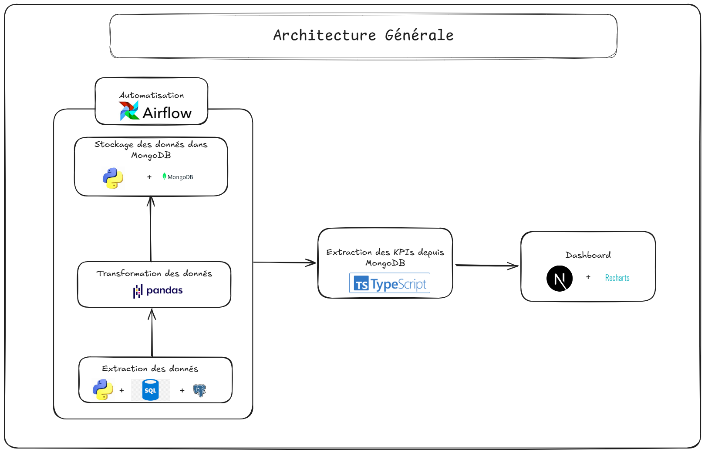

# Analyse des Performances Bancaires (Berka Dataset)

## 📜 Description du Projet

Ce projet vise à analyser les performances financières et opérationnelles d'une banque tchèque fictive sur la période 1993-1998, à partir du **Berka Dataset**. L'objectif est de fournir des insights exploitables aux parties prenantes (comme le CEO de la banque) via un tableau de bord interactif, en mettant en lumière les tendances, les comportements des clients, et les risques financiers. Les données incluent des informations sur les clients (5369), les comptes (4500), les transactions (~1 million), les prêts (~700), et les cartes de crédit (~900).

Le pipeline de traitement des données extrait les données brutes, calcule les KPI (indicateurs clés de performance), les stocke dans MongoDB Atlas, et les rend accessibles via un dashboard Next.js déployé à l'adresse suivante :  
[**Bank Performance Dashboard**](https://bank-performance.vercel.app/)

Le pipeline est automatisé avec **Apache Airflow** pour garantir des mises à jour régulières des KPI.


## 📊 KPI Calculés et Intégrés dans le Dashboard

Les KPI suivants ont été calculés et sont disponibles dans le dashboard :
- **`transaction_value_count_per_mounth_df.csv`** : Volume et chiffre d'affaires mensuels des transactions.
- **`transaction_operation.csv`** : Répartition des types d'opérations (retraits, paiements, etc.).
- **`transaction_value_count_per_count_df.csv`** : Nombre et valeur moyenne des transactions par compte.
- **`dominant_district_count_df.csv`** : Districts avec le plus de transactions.
- **`dominant_district_loan_count.csv`** : Districts avec le plus de prêts.
- **`loan_status_df.csv`** : Répartition des statuts des prêts (A, B, C, D).

Ces KPI permettent d’analyser les tendances transactionnelles, les disparités régionales, les comportements des clients, et les risques liés aux prêts.

---

## 🛠️ Architecture du Pipeline

Le pipeline est conçu pour traiter les données brutes, calculer les KPI, et les stocker dans une base de données MongoDB Atlas. Voici les étapes principales :

1. **Extraction des Données** :
   - Les données brutes (Berka Dataset) sont initialement stockées dans des fichiers CSV ou une base de données relationnelle (par exemple, Neon Postgres).
   - Les tables pertinentes (`trans`, `account`, `loan`, `district`, etc.) sont extraites.

2. **Calcul des KPI** :
   - Un script Python utilise `pandas` pour calculer les KPI mentionnés ci-dessus.
   - Les résultats sont exportés sous forme de fichiers CSV (par exemple, `transaction_value_count_per_mounth_df.csv`).

3. **Stockage dans MongoDB Atlas** :
   - Les KPI sont chargés dans MongoDB Atlas dans la base de données `payment_kpi_db`, avec une collection par KPI (par exemple, `volume_transactions`).
   - Un script Python utilise `pymongo` pour gérer la connexion et l’insertion des données.

4. **Automatisation avec Apache Airflow** :
   - Airflow est utilisé pour orchestrer le pipeline et automatiser les mises à jour quotidiennes des KPI.
   - Un DAG (Directed Acyclic Graph) est défini pour exécuter les étapes d’extraction, calcul, et stockage.

5. **Dashboard Next.js** :
   - Le dashboard récupère les KPI depuis MongoDB via des Server Actions Next.js, avec un fallback sur les fichiers CSV si la connexion échoue.
   - Le dashboard est déployé sur Vercel : [https://bank-performance.vercel.app/](https://bank-performance.vercel.app/).

---

## 🖼️ Architecture Finale



---

## 🚀 Mise en Place du Pipeline et Automatisation

### Prérequis

- **Python 3.12+** installé.
- **MongoDB Atlas** : Un cluster configuré avec une base de données `payment_kpi_db`.
- **Apache Airflow** : Installé localement ou sur un serveur.
- **Dépendances Python** : Listées dans `requirements.txt`.

### Étape 1 : Cloner le Projet

Clonez le dépôt contenant les scripts du pipeline :
```bash
git clone https://github.com/Martial2023/Bank-performance-pipeline.git
cd Bank-performance-pipeline
```

### Étape 2 : Installer les Dépendances

Installez les dépendances Python à partir de `requirements.txt` :
```bash
pip install -r requirements.txt
```

Contenu de `requirements.txt` :
```
pandas==2.0.3
pymongo==4.6.1
apache-airflow==2.7.3
```

### Étape 3 : Configurer les Variables d’Environnement

Créez un fichier `.env` dans le répertoire racine et ajoutez les variables suivantes :
```
MONGODB_URI=mongodb+srv://<username>:<password>@<cluster>.mongodb.net/payment_kpi_db?retryWrites=true&w=majority
DATA_PATH=/chemin/vers/berka-dataset/
```

- Remplacez `<username>`, `<password>`, et `<cluster>` par vos identifiants MongoDB Atlas.
- `DATA_PATH` doit pointer vers le répertoire contenant les fichiers CSV bruts du Berka Dataset.

### Étape 4 : Configurer Apache Airflow

1. **Initialiser Airflow** :
   Configurez Airflow et initialisez la base de données :
   ```bash
   export AIRFLOW_HOME=~/airflow
   airflow db init
   ```

2. **Créer un Utilisateur Airflow** :
   ```bash
   airflow users create \
     --username admin \
     --firstname Admin \
     --lastname User \
     --role Admin \
     --email admin@example.com
   ```


### Étape 5 : Lancer Airflow

1. **Démarrer le Serveur Web Airflow** :
   ```bash
   airflow webserver --port 8080
   ```

2. **Démarrer le Scheduler Airflow** (dans un autre terminal) :
   ```bash
   airflow scheduler
   ```

3. **Accéder à l’Interface Airflow** :
   - Ouvrez votre navigateur et allez à `http://localhost:8080`.
   - Connectez-vous avec les identifiants créés (par exemple, `admin`).
   - Activez le DAG `bank_pipeline` en cliquant sur le bouton "Toggle".

Le pipeline s’exécutera automatiquement tous les jours. Vous pouvez également le déclencher manuellement via l’interface Airflow.

---

## 📈 Dashboard Final

Le tableau de bord interactif est déployé sur Vercel :  
[**Bank Performance Dashboard**](https://bank-performance.vercel.app/)

Pour plus de détails sur le lancement et l’utilisation du dashboard, consultez le dépôt GitHub dédié :  
[**Bank Performance Dashboard Repository**](https://github.com/Martial2023/Bank-performance-analysis-dashboard)

---

## 📝 Conclusion

Ce projet fournit une solution complète pour analyser les performances d’une banque tchèque à partir du Berka Dataset. Le pipeline automatisé avec Airflow garantit des KPI à jour, tandis que le dashboard Next.js offre une interface intuitive pour explorer les données. Les KPI couvrent les transactions, les prêts, et les disparités régionales, permettant d’identifier les opportunités (promotions saisonnières) et les risques (défauts de prêt).

---

## 🤝 Contributions

Les contributions sont les bienvenues ! Si vous souhaitez ajouter de nouveaux KPI, améliorer le pipeline, ou optimiser le dashboard, ouvrez une issue ou soumettez une pull request sur les dépôts GitHub.

---

## 📜 Licence

Ce projet est sous licence MIT. Voir le fichier `LICENSE` pour plus de détails.

---